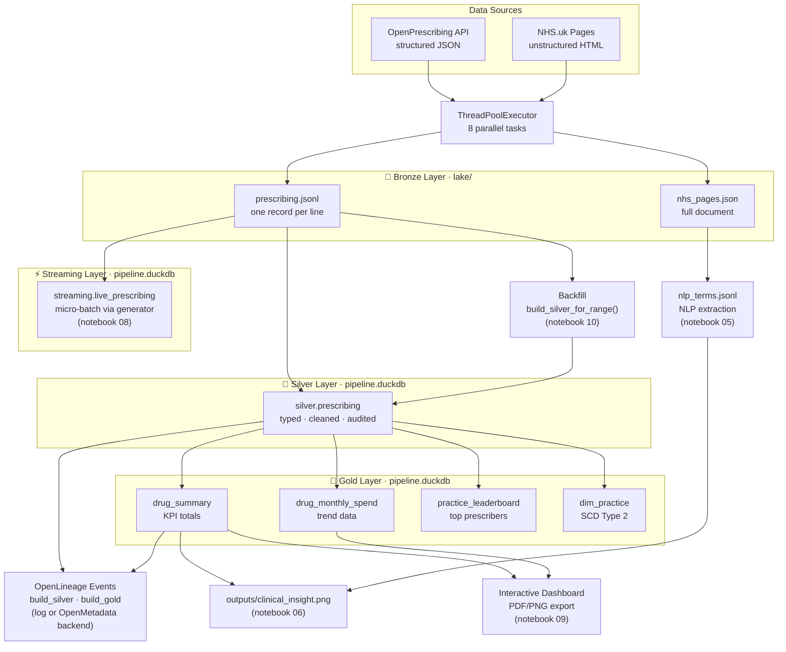
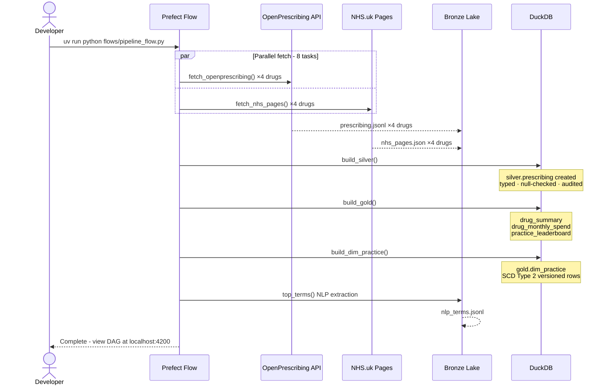
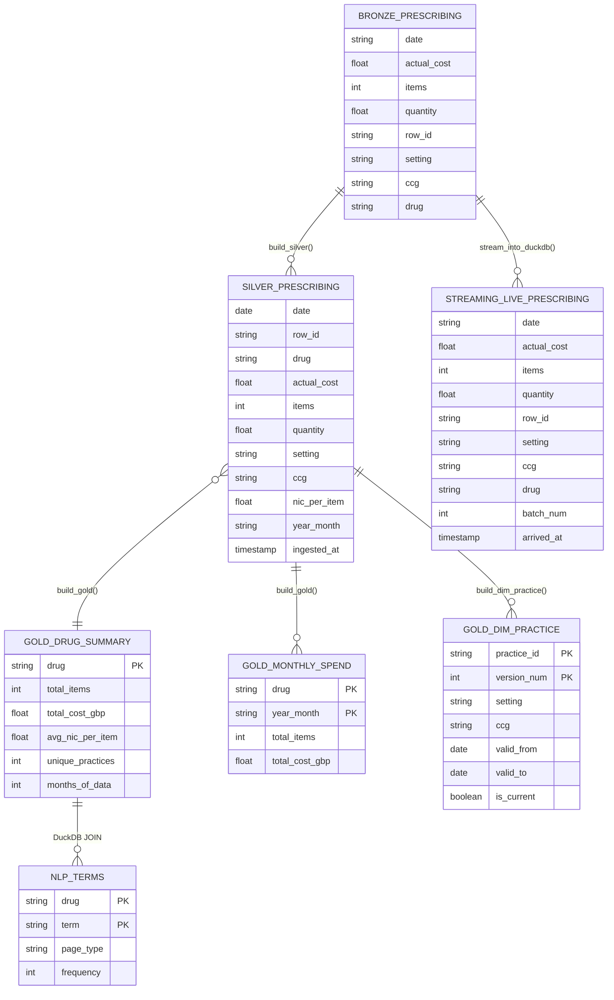

# UK Healthcare Big Data Pipeline

[](https://github.com/priya-gitTest/uk-healthcare-big-data-pipeline/actions)
[](https://www.python.org/)
[](LICENSE)

A hands-on, self-contained course for healthcare students demonstrating all **4 V's of big data** using two real UK open data sources, a modern Python toolchain, and production-grade orchestration.

You will build a complete pipeline that fetches NHS prescribing records and clinical prose, stores them in a layered **medallion data lake** (Bronze → Silver → Gold), queries with DuckDB SQL, transforms with Polars lazy evaluation, simulates **streaming** ingestion, implements **Slowly Changing Dimensions** (SCD Type 2), extracts NLP signals from NHS patient text, and visualises everything in a clinical insight chart.

---

## Contents

1. [Who This Is For](#who-this-is-for)
2. [What You Will Learn](#what-you-will-learn)
3. [Data Sources](#data-sources)
4. [Architecture](#architecture)
5. [Key Concepts Explained](#key-concepts-explained)
6. [Setup](#setup)
7. [Running the Notebooks](#running-the-notebooks)
8. [Running the Full Pipeline with Prefect](#running-the-full-pipeline-with-prefect)
9. [Project Structure](#project-structure)
10. [Running the Tests](#running-the-tests)
11. [GitHub Codespaces](#github-codespaces)
12. [Further Reading](#further-reading)
13. [Licence & Citation](#licence--citation)

---

## Who This Is For

- Healthcare professionals and students with basic Python familiarity who want to understand data engineering in an NHS context
- No prior data engineering experience required
- Useful as a reference for anyone moving from ad-hoc spreadsheet analysis to reproducible, scalable pipelines

---

## What You Will Learn

This course uses **Marimo notebooks** for interactive exploration and a **modular Python pipeline** for production-grade patterns — deliberately combining both.

That reflects a real and ongoing debate in the field. Notebooks are not inherently unproductive: tools like Marimo, Papermill, and Ploomber can run notebooks as pipeline steps, and organisations like Netflix and Databricks have done exactly that at scale. Data scientists and academics often prefer notebooks for the narrative, interactivity, and reproducibility they offer. Data engineers and MLOps practitioners tend to reach for modular code when they need testability, CI/CD, and audit trails.

The right choice depends on what you need right now:

| You need... | Reach for... |
|-------------|-------------|
| Explore data, share findings, iterate fast | A notebook (Jupyter, Marimo) |
| Run a notebook on a schedule with parameters | Papermill or Prefect + Marimo |
| Test individual functions, enforce contracts, track lineage | Modular code + orchestrator (this pipeline) |

This course teaches the patterns in the third row - not because notebooks are wrong, but because knowing when and how to move beyond them is a skill of its own.

| Concept | Why it matters | What you build | Notebook |
|---------|---------------|----------------|----------|
| **The 4 V's of big data** | Healthcare data is simultaneously huge, fast-changing, structurally inconsistent, and untrustworthy - you need a mental model before you can design solutions | See Volume, Velocity, Variety, Veracity in live NHS data | 01-06 |
| **Parallel data fetching** | Sequential fetching of 8 endpoints takes 4x longer; real pipelines cannot afford to wait | `ThreadPoolExecutor` cuts fetch time several-fold | 01 |
| **Bronze data lake** | If your transform logic is wrong you need to re-derive from raw, not re-fetch from the API | Raw JSONL + JSON files, write-once, never modified | 02 |
| **DuckDB SQL analytics** | Pandas loads everything into RAM; DuckDB queries files directly - the difference matters when data exceeds memory | Query raw lake files with SQL - no database server | 03 |
| **Polars lazy evaluation** | Pandas processes eagerly; lazy evaluation lets the engine optimise before touching data | Transform millions of records without loading into RAM | 04 |
| **NLP on clinical text** | 80% of healthcare data is unstructured text - ignoring it means ignoring most of the signal | Term-frequency analysis on NHS.uk patient pages | 05 |
| **Medallion architecture** | Without layers, a bug in Silver corrupts Gold silently; layers make it fixable without re-fetching | Bronze -> Silver (DuckDB) -> Gold (DuckDB) | 07 |
| **SCD Type 2** | NHS reorganised 106 CCGs into 42 ICBs in 2022 - without versioned dimensions, historical reports silently mis-attribute spend | Track GP practice attribute changes over time | 07 |
| **Streaming simulation** | Batch pipelines are blind to what is happening right now; knowing when to stream vs batch is a core engineering decision | Micro-batch ingestion via Python generators + DuckDB | 08 |
| **Data contracts** | Without contracts, a malformed API response becomes a silent NULL in Silver; contracts fail fast at the boundary | Pydantic models enforce schema at the API boundary; DQ gate halts the pipeline on null-rate breaches | Flow |
| **Lineage tracking** | When Gold figures change unexpectedly, lineage tells you which upstream change caused it | OpenLineage-format events emitted from Prefect tasks; log-only mode needs no backend | Flow |
| **Backfill** | When you fix a bug or add a new drug, you need to re-process history safely without touching unaffected data | Partition-level re-processing of Silver/Gold for a date range; idempotency proof | 10 |
| **Prefect orchestration** | Cron jobs have no retry logic, no UI, and no partial failure handling - orchestrators solve all three | `@flow` / `@task` with retries, logging, visual DAG | Flow |
| **Modern Python tooling** | Catching bugs before they reach production is cheaper than fixing them after | `uv`, `ruff`, `mypy`, `pre-commit`, GitHub Actions CI | Repo |

---

## Data Sources

| Source | URL | Format | Licence |
|--------|-----|--------|---------|
| OpenPrescribing API | https://openprescribing.net/api/ | JSON (REST API) | Open Government Licence v3.0 |
| NHS.uk Medicines Pages | https://www.nhs.uk/medicines/ | HTML (scraped) | Open Government Licence v3.0 |

No API keys required for either source.

### The Four Drugs Used Throughout

| Drug | BNF Code | Indication |
|------|----------|-----------|
| Metformin | 0601023A0 | Type 2 diabetes (most prescribed drug in England) |
| Atorvastatin | 0212000B0 | High cholesterol |
| Lisinopril | 0205051R0 | Hypertension / Heart failure |
| Amlodipine | 0206020A0 | Hypertension / Angina |

---

## Architecture

### Pipeline Flow



### Pipeline Execution Sequence



### Data Model (ERD)



---

## Key Concepts Explained

### 1. The 4 V's of Big Data

The 4 V's are the canonical framework for characterising big data challenges. Each appears concretely in NHS prescribing data.

#### Volume - data too large for a spreadsheet

NHS England processes **~1.1 billion prescription items per year** (NHS BSA, 2024). This pipeline pulls ~1 million practice-month records for just four drugs. Excel's row limit (1,048,576) would be exceeded by a single drug's history.

**How this pipeline handles it:** DuckDB queries the raw JSONL files in-place using predicate pushdown - it reads only the rows and columns needed. Polars `scan_ndjson()` returns a `LazyFrame` that describes *what* to compute without reading anything from disk until `.collect()` is called.

**Real-world implication:** A dashboard that loads the full dataset into a Python list before filtering will run out of memory at scale. Lazy evaluation and column pruning are not optional at NHS scale - they are requirements.

> 📖 Read more: [IBM - The 4 V's of Big Data](https://www.ibm.com/think/topics/4-vs-of-big-data) · [Polars Lazy API](https://docs.pola.rs/user-guide/lazy/)

---

#### Velocity - speed of data arrival and processing

NHS BSA publishes prescribing data **monthly**, but real-time NHS systems - NHS 111 (~80,000 calls/day), A&E breach monitoring, bed occupancy dashboards - need near-real-time updates. Velocity covers both how fast data arrives and how quickly the pipeline must respond.

**How this pipeline handles it:**
- `ThreadPoolExecutor` fetches 8 sources in parallel, cutting wall-clock fetch time several-fold vs sequential calls
- Prefect `@task(retries=2, retry_delay_seconds=exponential_backoff(...))` handles transient API failures automatically
- Notebook 08 simulates streaming ingestion: records are replayed as micro-batches via a Python generator and inserted into DuckDB incrementally

**Real-world implication:** An NHS 111 surge detection system cannot wait for a nightly batch job. Streaming micro-batch processing (Kafka, Redpanda, Kinesis, or the generator pattern here) reduces latency from hours to seconds.

> 📖 Read more: [Streaming 101 - Tyler Akidau, O'Reilly](https://www.oreilly.com/radar/the-world-beyond-batch-streaming-101/) · [Apache Kafka Introduction](https://kafka.apache.org/intro) · [Redpanda Quickstart](https://docs.redpanda.com/current/get-started/quick-start/)

---

#### Variety - multiple incompatible formats and sources

This pipeline ingests from two sources in three formats - all in the same pipeline run:

| Source | Format | Content |
|--------|--------|---------|
| OpenPrescribing API | JSONL (newline-delimited JSON) | Structured prescribing records |
| NHS.uk Medicines Pages | JSON (document) | Semi-structured section headings + prose |
| NHS.uk raw HTML | HTML | Fully unstructured clinical text |

All three are joined with a single DuckDB SQL query in notebook 06.

**Real-world implication:** An NHS hospital data warehouse typically joins HL7 FHIR records (JSON), discharge summaries (PDF/text), waiting list exports (CSV), and live IoT sensor streams (binary). The variety challenge is not just technical (parsing) but analytical: how do you trust data from sources with fundamentally different quality guarantees?

> 📖 Read more: [HL7 FHIR Overview](https://hl7.org/fhir/overview.html) · [DuckDB - reading multiple file formats](https://duckdb.org/docs/data/overview)

---

#### Veracity - how much can you trust the data?

Real NHS prescribing data has missing values: some practices submit records without costs, some without item counts. Blindly computing averages over data with silent nulls produces wrong results. Veracity is about making data-quality issues explicit and measurable.

**How this pipeline handles it:**
- Silver layer uses `TRY_CAST` rather than `CAST` - malformed values become `NULL` rather than crashing the pipeline
- `veracity_report()` quantifies the null count and percentage for every key field
- SCD Type 2 (`gold.dim_practice`) tracks how dimension attributes change - a different kind of data trust issue

**Real-world implication:** A clinical dashboard that silently drops null costs will undercount NHS spend. A pharmacovigilance signal based on miscounted items could trigger unnecessary drug alerts. Veracity is a patient-safety concern, not just a data engineering concern.

> 📖 Read more: [Data Quality in Healthcare - NHS Digital](https://digital.nhs.uk/data-and-information/data-tools-and-services/data-services/data-quality) · [Great Expectations (data quality tool)](https://greatexpectations.io/)

---

### 2. Medallion Architecture (Bronze → Silver → Gold)

The medallion pattern organises a data lake into three layers with progressively stricter quality guarantees. It was popularised by Databricks and is now the standard pattern in AWS, Azure, and GCP data lake implementations (Delta Lake, Apache Iceberg, Apache Hudi).

```
Bronze ──► Silver ──► Gold
(raw)      (trusted)  (business-ready)
```

#### Why three layers?

**Single-layer problem:** if you transform data in place, a bug in your transformation destroys the original. You cannot re-derive the correct answer.

**Two-layer problem:** a raw → curated pattern works but conflates "trustworthy" with "business-ready". An analyst querying the curated layer still encounters raw types and unresolved nulls.

**Three layers** give you:
1. A ground truth you can always reprocess from (Bronze)
2. A trust boundary safe to hand to analysts (Silver)
3. Pre-aggregated answers to specific business questions (Gold)

#### Bronze - `lake/`

Raw data exactly as received. JSONL for prescribing records, JSON for NHS pages. Written once by `lake.py`, never modified.

**Rule:** if a Silver or Gold transformation has a bug, you fix the *code* and re-derive from unchanged Bronze. You never edit a Bronze file.

**NHS analogy:** NHS BSA's raw submission files. Every statistic published by NHS Digital must be traceable back to these source files for audit.

#### Silver - `silver.prescribing` in `pipeline.duckdb`

The trust boundary. `build_silver()` applies:
- `TRY_CAST` for all numeric fields (bad values become `NULL`, not errors)
- Derived `nic_per_item` (net ingredient cost per item)
- Derived `year_month` partition key
- Drops rows where *both* cost and items are `NULL` (analytically worthless)
- Adds `ingested_at` audit timestamp

An analyst can query Silver without expecting surprises.

#### Gold - `gold.*` tables in `pipeline.duckdb`

Business-ready aggregations. `build_gold()` creates:
- `gold.drug_summary` - total items, cost, avg NIC per drug (KPI dashboard table)
- `gold.drug_monthly_spend` - monthly trend data (time-series charts)
- `gold.practice_leaderboard` - top 20 practices per drug (leaderboard)

These tables answer specific questions and load instantly. They are what you would connect to Power BI, Tableau, or a REST API.

> 📖 Read more: [Databricks - Medallion Architecture](https://www.databricks.com/glossary/medallion-architecture) · [Delta Lake Introduction](https://docs.delta.io/latest/delta-intro.html) · [Apache Iceberg](https://iceberg.apache.org/)

---

### 3. Streaming Data Pipelines

Streaming means processing data records as they arrive, rather than waiting to accumulate a complete batch.

#### Batch vs Streaming

| | Batch | Streaming |
|---|---|---|
| Data arrival | All at once (e.g. monthly BSA export) | Continuously (e.g. per prescription issued) |
| Processing trigger | Scheduled (nightly job) | Event-driven or micro-batch |
| Memory usage | Full dataset | One batch at a time |
| Latency to insight | Hours / days | Seconds / minutes |
| NHS example | Monthly prescribing export | Live A&E admissions, bed occupancy |

#### The generator = stream pattern

This project teaches streaming without any message broker (Kafka, RabbitMQ, AWS Kinesis). A Python generator is conceptually identical to a Kafka consumer:

```python
# Kafka consumer (production)           # Generator (this course)
consumer.poll(timeout_ms=1000)    ←→    prescribing_event_stream(lake_dir, drug)
  yields a batch of messages              yields a list of records
  commits offset when done               advances file pointer when done
```

The code that *receives* the batch and writes to DuckDB is identical in both cases - only the source changes.

#### The micro-batch pattern

`batch_size` controls the throughput-latency trade-off:
- **Small batch** (e.g. 10 records): low latency (dashboard updates frequently), high overhead (many insert operations)
- **Large batch** (e.g. 10,000 records): high throughput, higher latency

This is the same parameter you tune in Spark Structured Streaming (`trigger(processingTime="30 seconds")`) or Kafka Streams. In production you would replace the Python generator with a **Kafka** topic or **Redpanda** (a Kafka-compatible broker written in C++, no ZooKeeper, faster startup - popular in NHS/healthcare orgs that want Kafka semantics without the operational overhead).

#### NHS streaming use cases

- **NHS 111 surge detection** - ~80,000 calls/day; a 5-minute rolling window detects demand spikes
- **A&E 4-hour breach alert** - stream admission records; alert when a patient has been waiting >3h 45m
- **Sepsis screening** - stream vital-signs observations; score each patient on every update
- **Bed capacity management** - stream discharge and admission events; maintain real-time occupancy

All four use cases are a natural fit for **Redpanda** as the broker: low-latency ingestion, Kafka-compatible consumers (Spark Structured Streaming, Flink, ksqlDB), and straightforward single-node deployment for a trust-level proof of concept before scaling out.

> 📖 Read more: [Streaming 101 - O'Reilly](https://www.oreilly.com/radar/the-world-beyond-batch-streaming-101/) · [Kafka Quickstart](https://kafka.apache.org/quickstart) · [Redpanda Quickstart](https://docs.redpanda.com/current/get-started/quick-start/)
---

### 4. Slowly Changing Dimensions (SCD Type 2)

A **Slowly Changing Dimension** is a dimension entity (e.g. a GP practice) whose attributes change slowly over time. How you handle those changes determines whether your historical analysis is correct.

#### The NHS context: CCG → ICB reorganisation (July 2022)

In July 2022 England's **106 Clinical Commissioning Groups (CCGs)** were dissolved and replaced by **42 Integrated Care Boards (ICBs)**. Every GP practice in England now has two valid answers to "which commissioning body are you in?" depending on when you ask.

Without SCD Type 2, a query like *"how much did NHS Cornwall ICB spend on metformin in financial year 2021–22?"* would assign the ICB code to all historical records - overstating spend for newly-created ICBs and understating it for abolished CCGs.

#### SCD Type comparison

| Type | Approach | History | When to use |
|------|----------|---------|-------------|
| **Type 0** | Ignore changes | Never updated | Truly fixed attributes (date of birth) |
| **Type 1** | Overwrite in place | Lost | Correcting data-entry errors |
| **Type 2** | Add versioned row | Full | Attribute changes that matter for point-in-time queries |
| **Type 3** | Add "previous value" column | One level only | Rarely useful; cannot handle >1 change |

**Type 2 is the industry default** for audit-required healthcare analytics.

#### How SCD Type 2 works

Each practice-version gets three extra columns:

```
practice_id  ccg   setting  valid_from   valid_to     is_current
──────────── ───── ──────── ──────────── ──────────── ──────────
E84006       03V   4        2015-01-01   2022-07-01   FALSE
E84006       15N   4        2022-07-01   NULL         TRUE
```

- `valid_from` - when this version of the practice became active
- `valid_to` - when this version expired (`NULL` = still active)
- `is_current` - convenience flag; always `TRUE` for the row where `valid_to IS NULL`

A **point-in-time query** retrieves the correct version for any analysis date:

```sql
-- "What CCG/ICB did practice E84006 belong to on 1 January 2022?"
SELECT ccg FROM gold.dim_practice
WHERE practice_id = 'E84006'
  AND valid_from <= DATE '2022-01-01'
  AND (valid_to IS NULL OR valid_to > DATE '2022-01-01')
-- Returns: 03V  (the old CCG - correct for that date)
```

#### How it is implemented here

`build_dim_practice()` in `medallion.py` uses DuckDB window functions:
1. Groups Silver records by `(practice_id, setting, ccg)` - each unique combination is one version
2. Uses `LEAD()` to find when the next version starts - that becomes `valid_to` for the current version
3. The most recent version has `valid_to = NULL` and `is_current = TRUE`

> 📖 Read more: [Kimball Group - SCD Type 2](https://www.kimballgroup.com/data-warehouse-business-intelligence-resources/kimball-techniques/dimensional-modeling-techniques/slowly-changing-dimension-type-2/) · [Wikipedia - Slowly Changing Dimension](https://en.wikipedia.org/wiki/Slowly_changing_dimension) · [The Data Warehouse Toolkit, Kimball & Ross (book)](https://www.kimballgroup.com/data-warehouse-business-intelligence-resources/books/data-warehouse-dw-toolkit/)

---

## Setup

### Prerequisites

- Python 3.11+
- [`uv`](https://docs.astral.sh/uv/) - fast Python package manager
- `git`

### Install

```bash
# Clone the repository
git clone https://github.com/priya-gitTest/uk-healthcare-big-data-pipeline.git
cd uk-healthcare-big-data-pipeline

# Install all dependencies (creates .venv automatically)
uv sync --all-extras

# Install pre-commit hooks
uv run pre-commit install
```

---

## Running the Notebooks

Run notebooks in order 00 → 10. Each builds on the outputs of the previous one.

```bash
# Open a specific notebook (browser opens at http://localhost:2718)
uv run marimo edit notebooks/00_introduction.py
```

| Notebook | Topic | Key V's |
|----------|-------|---------|
| `00` | Introduction - why pipelines, the 4 V's, data sources | All (conceptual) |
| `01` | Parallel fetch - ThreadPoolExecutor timing | Volume, Velocity |
| `02` | Bronze data lake - JSONL + JSON side-by-side | Variety |
| `03` | DuckDB SQL - query raw lake files | Volume |
| `04` | Polars lazy transform + veracity report | Volume, Veracity |
| `05` | NLP on NHS clinical text | Variety |
| `06` | DuckDB JOIN + matplotlib clinical insight chart | All four |
| `07` | Medallion architecture + SCD Type 2 | Veracity, Volume |
| `08` | Streaming simulation via generators + DuckDB | Velocity |
| `09` | Interactive dashboard, reactive filters, PDF/PNG export | All four |
| `10` | Backfill - partition-level re-processing of Bronze → Silver → Gold for a date range | Veracity |

> Run notebooks 01–02 before 03–10 (they populate `lake/` which later notebooks read).

---

## Running the Full Pipeline with Prefect

After completing the notebooks, run the production-grade orchestration:

```bash
# Terminal 1 - start Prefect server and UI
uv run prefect server start

# Terminal 2 - execute the full pipeline
uv run python flows/pipeline_flow.py
```

Open **http://localhost:4200** to watch the pipeline run in real time, see task retries, and inspect structured logs.

The Prefect flow runs all steps in order:
1. Parallel fetch (8 tasks - 4 drugs × 2 sources) - payloads validated against Pydantic contracts
2. Write to Bronze lake
3. Polars transformation + veracity report
4. Build Silver layer (`silver.prescribing`) - lineage event emitted
5. **DQ gate** - `validate_silver_task` checks null-rate thresholds; fails the flow if breached
6. Build Gold layer (`gold.drug_summary`, `gold.drug_monthly_spend`, `gold.practice_leaderboard`) - lineage event emitted
7. Build SCD Type 2 dimension (`gold.dim_practice`)
8. NLP term extraction per drug

**Optional: lineage backend**

Set `OPENLINEAGE_URL` to POST lineage events to a running OpenMetadata instance.
Without it, lineage events are logged as structured JSON - no extra infra needed.

```bash
# Run OpenMetadata locally (requires Docker Compose):
curl -sL https://github.com/open-metadata/OpenMetadata/releases/latest/download/docker-compose.yml \
  | docker compose -f - up -d

# Open http://localhost:8585 for the OpenMetadata UI (default login: admin / admin)

# Then run the pipeline with lineage emission:
OPENLINEAGE_URL=http://localhost:8585 uv run python flows/pipeline_flow.py
```

---

## Project Structure

```
uk-healthcare-big-data-pipeline/
├── .devcontainer/
│   └── devcontainer.json          # GitHub Codespaces: Python 3.11, ports 2718 + 4200
├── .github/
│   └── workflows/
│       └── ci.yml                 # GitHub Actions: ruff + mypy + pytest -m "not slow"
├── .pre-commit-config.yaml        # ruff-format, ruff-check, mypy, trailing-whitespace
├── pyproject.toml                 # uv project, all deps, ruff/mypy/pytest config
├── src/
│   └── pipeline/
│       ├── fetch.py               # HTTP acquisition - httpx + BeautifulSoup + Pydantic validation
│       ├── lake.py                # Bronze layer read/write (JSONL + JSON)
│       ├── medallion.py           # Silver + Gold + SCD Type 2 + backfill (DuckDB)
│       ├── contracts.py           # Pydantic data contracts + SilverDQViolation
│       ├── lineage.py             # OpenLineage event emission (log-only or OpenMetadata backend)
│       ├── stream.py              # Streaming simulation - generator + DuckDB sink
│       ├── transform.py           # Polars lazy transforms + veracity report
│       ├── nlp.py                 # Tokenisation + term frequency (Polars)
│       └── visualise.py           # matplotlib chart functions
├── flows/
│   └── pipeline_flow.py           # Prefect @flow + @task with retries, DQ gate, lineage
├── notebooks/
│   ├── 00_introduction.py         # Why pipelines? The 4 V's. Architecture.
│   ├── 01_parallel_fetch.py       # ThreadPoolExecutor - Volume + Velocity
│   ├── 02_raw_lake.py             # Bronze layer - Variety made visible
│   ├── 03_duckdb_query.py         # SQL on raw JSONL - Volume
│   ├── 04_polars_transform.py     # Lazy eval + veracity report - Veracity
│   ├── 05_nlp_unstructured.py     # Clinical text NLP - Variety
│   ├── 06_join_and_visualise.py   # DuckDB JOIN + matplotlib 2×2 - all 4 V's
│   ├── 07_medallion_architecture.py  # Bronze → Silver → Gold + SCD Type 2
│   ├── 08_streaming_simulation.py    # Streaming via generators + DuckDB
│   ├── 09_dashboard_report.py        # Interactive dashboard + PDF/PNG export
│   └── 10_backfill.py               # Partition-level backfill + idempotency
├── tests/
│   ├── test_fetch.py              # Mock httpx; response shape + keys
│   ├── test_transform.py          # Polars lazy frame + veracity report
│   ├── test_nlp.py                # Tokeniser + top_terms
│   ├── test_medallion.py          # Silver, Gold, SCD Type 2, backfill
│   ├── test_contracts.py          # Pydantic models + DQ gate
│   ├── test_lineage.py            # Lineage event structure + context manager
│   ├── test_lake.py               # Bronze read/write + atomic writes
│   ├── test_stream.py             # Generator batching + DuckDB sink
│   ├── test_visualise.py          # Chart rendering + export
│   └── test_pipeline.py           # @pytest.mark.slow - live API integration tests
└── lake/                          # Created at runtime, gitignored (Bronze layer)
```

---

## Running the Tests

```bash
# All unit tests - fast, no internet required
uv run pytest tests/ -v -m "not slow"

# Integration tests - hits live OpenPrescribing API
uv run pytest tests/ -v -m slow

# Linting
uv run ruff check src/ flows/

# Type checking
uv run mypy src/
```

Current test count: **190+ unit tests** across fetch, transform, NLP, medallion (Silver, Gold, SCD Type 2, backfill), data contracts, lineage, lake, stream, and visualise.

---

## GitHub Codespaces

This repository includes a `.devcontainer/devcontainer.json` configuration. Click **"Open in Codespaces"** on GitHub and the environment is set up automatically.

Ports forwarded:
- **2718** - Marimo notebook UI
- **4200** - Prefect orchestration UI
- **8585** - OpenMetadata UI + lineage API (optional; start with Docker Compose)

---

## Further Reading

### The 4 V's of Big Data
- [IBM - The 4 V's of Big Data](https://www.ibm.com/think/topics/4-vs-of-big-data) - accessible conceptual overview
- [Data Quality in Healthcare - NHS Digital](https://digital.nhs.uk/data-and-information/data-tools-and-services/data-services/data-quality) - how Veracity is approached in the NHS

### Medallion Architecture
- [Databricks - Medallion Architecture](https://www.databricks.com/glossary/medallion-architecture) - the definitive introduction from the team that coined it
- [Delta Lake - Why Delta](https://docs.delta.io/latest/delta-intro.html) - open-source storage layer for medallion lakes
- [Apache Iceberg](https://iceberg.apache.org/) - alternative open table format used in AWS and GCP

### DuckDB
- [DuckDB Documentation](https://duckdb.org/docs/) - complete reference
- [Why DuckDB](https://duckdb.org/why_duckdb) - when in-process SQL beats a database server
- [DuckDB JSONL performance](https://duckdb.org/docs/data/json/overview) - reading JSON and JSONL natively

### Polars
- [Polars User Guide](https://docs.pola.rs/) - lazy evaluation, expressions, and performance
- [Polars vs Pandas](https://docs.pola.rs/user-guide/migration/pandas/) - when to switch and why

### Streaming
- [The World Beyond Batch: Streaming 101 - Tyler Akidau, O'Reilly](https://www.oreilly.com/radar/the-world-beyond-batch-streaming-101/) - the best conceptual introduction to streaming
- [Apache Kafka Introduction](https://kafka.apache.org/intro) - the industry-standard message broker
- [Redpanda Quickstart](https://docs.redpanda.com/current/get-started/quick-start/) - Kafka-compatible broker, no ZooKeeper, easier to operate; well-suited for single-trust or on-prem NHS deployments
- [httpx Streaming Responses](https://www.python-httpx.org/quickstart/#streaming-responses) - HTTP-level chunked streaming

### Slowly Changing Dimensions (SCD)
- [Kimball Group - SCD Type 2](https://www.kimballgroup.com/data-warehouse-business-intelligence-resources/kimball-techniques/dimensional-modeling-techniques/slowly-changing-dimension-type-2/) - the definitive reference from the dimensional modelling founders
- [Wikipedia - Slowly Changing Dimension](https://en.wikipedia.org/wiki/Slowly_changing_dimension) - all SCD types with examples
- *The Data Warehouse Toolkit* - Kimball & Ross (book) - the canonical textbook for dimensional modelling

### Orchestration
- [Prefect Documentation](https://docs.prefect.io/) - flows, tasks, retries, and the UI
- [Prefect vs Airflow](https://www.prefect.io/blog/prefect-vs-airflow) - when to choose which

### NHS Open Data
- [OpenPrescribing About](https://openprescribing.net/about/) - context on the prescribing data
- [OpenPrescribing API Docs](https://openprescribing.net/api/) - all available endpoints and query parameters
- [NHS BSA Open Data Portal](https://opendata.nhsbsa.net/) - broader NHS open data catalogue including primary care data
- [NHS Digital - Data and Information](https://digital.nhs.uk/data-and-information) - secondary uses and hospital episode statistics
- [Bennett Institute for Applied Data Science](https://www.bennett.ox.ac.uk/) - Oxford team that builds and maintains OpenPrescribing

### Data Contracts & Quality
- [Pydantic Documentation](https://docs.pydantic.dev/) - data validation and settings management using Python type annotations
- [Great Expectations](https://greatexpectations.io/) - declarative data quality testing framework for production pipelines
- [Monte Carlo Data](https://www.montecarlodata.com/) - data observability platform used at scale
- [dbt Tests](https://docs.getdbt.com/docs/build/tests) - SQL-based data quality assertions integrated with dbt transformations

### Lineage & Observability
- [OpenLineage Specification](https://openlineage.io/) - vendor-neutral standard for capturing data lineage events
- [OpenMetadata](https://open-metadata.org/) - open-source data catalogue with native OpenLineage ingestion, column-level lineage, data quality integration, and schema metadata
- [Prefect + OpenLineage](https://docs.prefect.io/latest/guides/openlineage/) - official Prefect integration for automatic lineage emission from flows

### Backfill & Partition Management
- [Delta Lake - Time Travel](https://docs.delta.io/latest/delta-utility.html#restore-a-delta-table-to-an-earlier-state) - how Delta Lake handles re-processing with MERGE and time travel
- [Apache Iceberg - Partitioning](https://iceberg.apache.org/docs/latest/partitioning/) - hidden partitioning that makes backfill scans efficient
- [Kafka - Offset Management](https://kafka.apache.org/documentation/#consumerconfigs_auto.offset.reset) - how Kafka consumers replay historical messages for backfill

### Future: Distributed Extensions
This pipeline deliberately runs on a single node (DuckDB + Polars) so you can focus on architecture, not infrastructure.  When you are ready to scale to distributed systems, the architectural patterns transfer directly:

| Single-node (this pipeline) | Distributed equivalent | What changes |
|-----------------------------|------------------------|-------------|
| `duckdb.connect()` SQL | Apache Spark + `pyspark.sql` | Replace connection with `SparkSession`; SQL syntax is nearly identical |
| JSONL files in `lake/` | Delta Lake or Apache Iceberg on S3/GCS | Replace file writes with `df.write.format("delta").save(path)`; ACID guarantees at scale |
| Python generator stream | Apache Kafka consumer | Replace `prescribing_event_stream()` with `KafkaConsumer`; batch logic is unchanged |
| DuckDB `DELETE` + `INSERT` backfill | Delta Lake `MERGE INTO` | MERGE handles upserts atomically and records history in the transaction log |
| `validate_silver_task` null checks | Great Expectations suite | Replace threshold dict with a GE `ExpectationSuite`; same concept, declarative YAML |
| `lineage.py` log-only mode | Full OpenMetadata | Set `OPENLINEAGE_URL=http://localhost:8585`; no code changes needed |

**Recommended next step:** replace the DuckDB storage layer with Delta Lake by swapping `medallion.py` for a PySpark + `delta` session.  The Bronze lake stays unchanged; only Silver/Gold writes use Delta format.  This unlocks time travel, MERGE-based backfill, and concurrent writer safety.

### General Data Engineering
- [Pessini's Pipeline Guide](https://pessini.medium.com/building-end-to-end-data-pipelines-a-hands-on-guide-for-data-scientists-part-1-adcdc7bce22a) - the article that inspired this course
- *Fundamentals of Data Engineering* - Reis & Housley (O'Reilly, 2022) - best single book on the field

---

## Licence & Citation

- **Code**: MIT Licence - see [LICENSE](LICENSE)
- **Data**: Open Government Licence v3.0 - NHS BSA and NHS England open data

### Citation

> Inspired by: Pessini, L. (2025). *Building End-to-End Data Pipelines: A Hands-On Guide for Data Scientists*. Medium.
>
> Data: NHS Business Services Authority. *Prescribing Cost Analysis England*. Open Government Licence v3.0.
> NHS England. *NHS.uk Medicines Information*. Open Government Licence v3.0.
